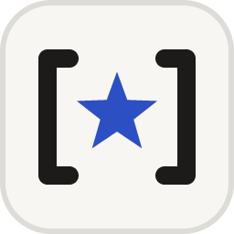
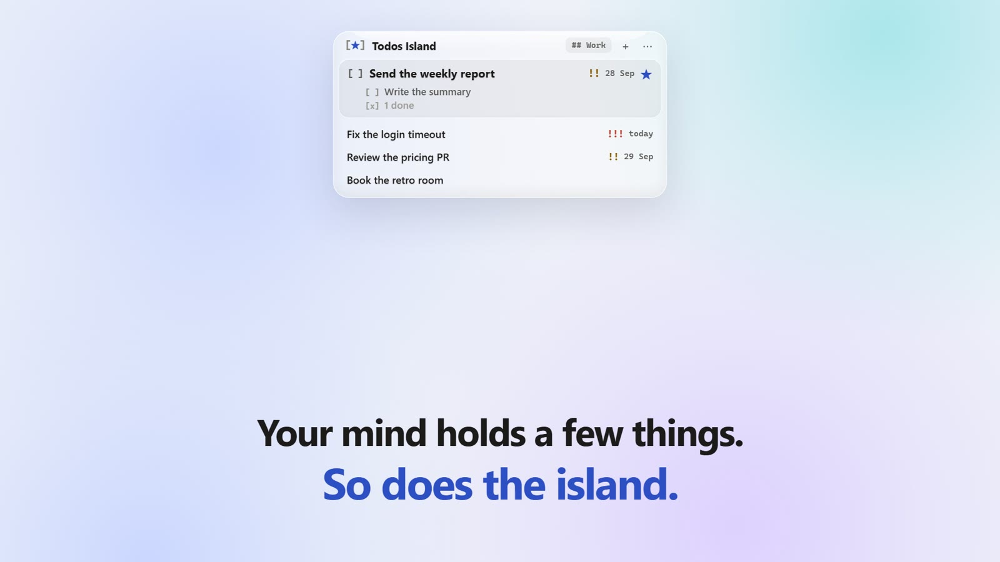
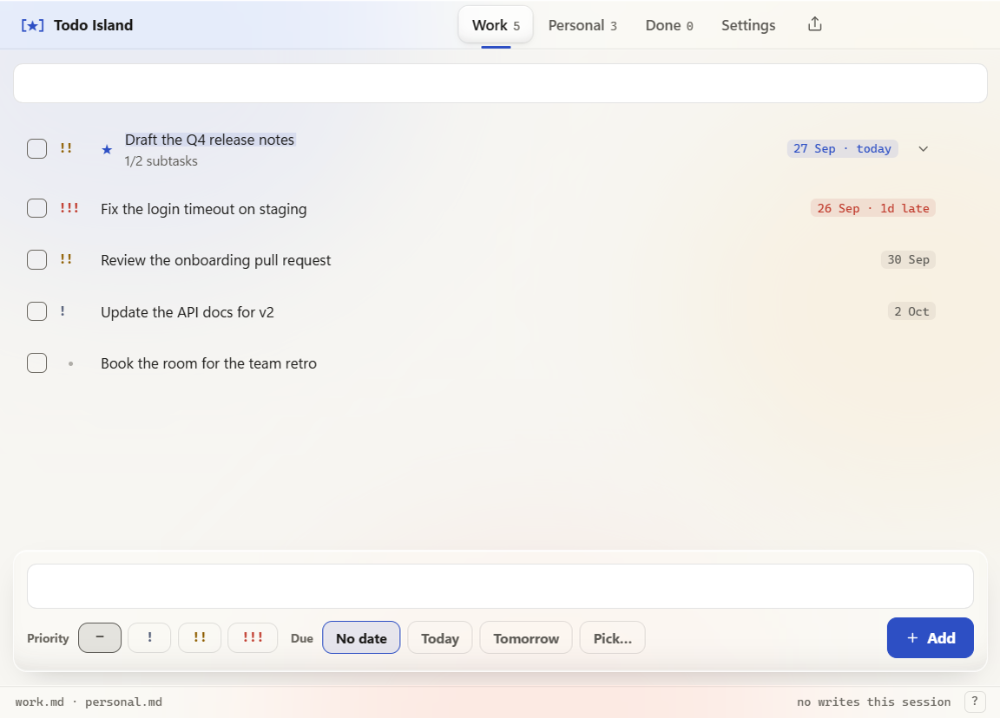
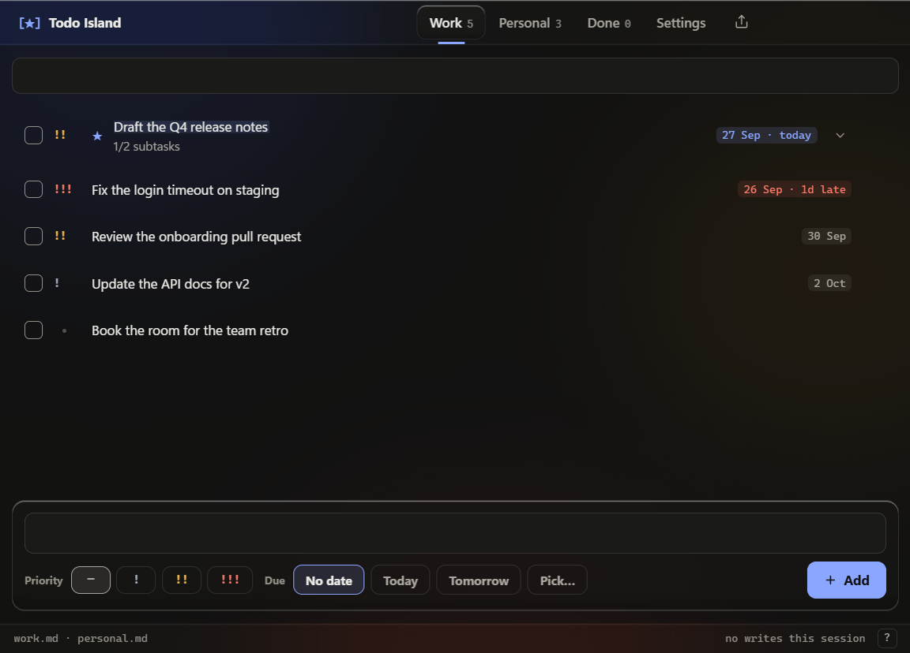

# Todos Island

**Your todo list, dropping in from the top of your screen.** A Dynamic-Island-style reminder for Windows that reads the plain markdown notes you already keep. No account, no database, no cloud.

  

[](docs/todos-island-promo.mp4)

<p align="center"><a href="docs/todos-island-promo.mp4">▶ Watch the 45-second film</a></p>

## Why another todo app?

You don't forget your tasks because they left your head. You forget them because you went ten levels deep into the details, and the main thing got lost on the way. Most todo apps don't help with that: they wait in a window you have to remember to open, they show you sixty tasks at once, and they're dull enough that you stop looking.

Todos Island turns that around:

- **It comes to you.** A small island drops from the top of the screen on a schedule you set, shows the task you're on and the next few, then tucks itself away. It never takes your keyboard focus.
- **It keeps the list short.** Most days you work on one to three things. The island puts the task you're doing **now** first and shows only the next few. The full list is one click away.
- **Your notes stay the source of truth.** Tasks live in ordinary `.md` files that you can open and edit in Obsidian, VS Code, Notepad or anything else. The app reads them and writes back only when you click something.
- **Time decides what shows.** Work tasks lead during your workday. Personal tasks lead in the evening and on weekends.
- **Marks, not words.** ★ is what you're on, `!!!` is urgent, `28 Sep` is when it's due, `[ ]` is a subtask. You read it at a glance.
- **Nice enough to look at.** Glass, themes, light and dark. If the list lives somewhere dull, you stop checking it.
- **Report your day in one click.** Copy "Done today · Now · Next" for your team chat.

## The notation

To set priority, a due date or the task you're on, just type it at the start of the line:

```markdown
- [ ] /now !! 26 Sep -- Send the weekly report
	client wants the numbers split by region
	- [x] Pull the numbers
	- [ ] Write the summary
- [ ] !!! Fix the login timeout
- [ ] Book the retro room
```

| Token | Meaning |
|---|---|
| `/now` | **Now**: what you're working on (you can mark several) |
| `--` | separates the marks from the title |
| `!` `!!` `!!!` | priority: low, medium, high |
| `26 Sep` | due date (the year is worked out for you) |
| indented `- [ ]` | a subtask; `- [ ] !! -- call Sam` gives it a priority too (subtasks take `!` `!!` `!!!` only) |
| indented plain text | a description |

When the app writes a task, it adds a small hidden stamp at the end of the line, such as `<!-- c:2026-09-27T14:05 u:2026-09-27T15:10 -->`. It records when the task was created and last changed. Obsidian and other markdown viewers hide it. The app uses it to order your list: soonest due date first, then priority, then most recently changed. Done tasks show newest first. You never need to type it.

Older notes that use `*` for Now and the wide dash `—` as the separator still read exactly the same. The app writes the new style (`/now`, `--`) only on the lines it changes.

The tokens can go in any order, and all of them are optional. The app's own editor and quick-add box accept the same tokens, so what you type in the app is exactly what lands in your note.

## Features

- **The island.** It drops in on two schedules: one interval for your workday and one for evenings and weekends, each with its own on/off switch. Nothing pops between midnight and the start of your day. Weekends (Saturday + Sunday, or Friday + Saturday, following your Windows region or your pick) run the evening schedule.
  - Click a task to make it Now; click its ★ to set it back (Not now).
  - Tick `[ ]` to complete it. Hover a task for its edit pencil; **+** in the top bar adds a task in the tasks window.
  - Open subtasks always show, most important first; done ones tuck away behind one line.
  - Pin the island to keep it on screen.
  - Press <kbd>Ctrl</kbd>+<kbd>`</kbd> to show or hide it (change it in Settings).
- **Glass themes.** The island is frosted glass over a soft picture you choose in *Settings → Look → Theme*: **Mist**, **Dusk**, **Lagoon**, **Bloom** or **Dune**.
  - Every theme has a light and a dark version. Pick **Light**, **Dark** or **System** in *Settings → Look → Appearance*; every window follows it.
  - Choose how much of the theme shows through in *Settings → Look → Glass*: **Solid**, 20%, 35%, 50% or 65%.
  - The picture is drawn once, not recorded from your screen, so nothing lags or runs in the background.
  - Pick a **theme color** (blue, violet, teal, pink or graphite) and separate **label** and **task text sizes** in *Settings*.
  - Every window (tasks, editor, Share and setup) wears the same theme as clear liquid glass, and the Glass setting controls how much shows through there too.
  - Settings save as you change them. There's no Save button.
- **Undo for everything.** Complete, delete, un-mark Now, reorder or clear done: every change you make gets a short countdown with an Undo button.
- **Share your day.** Pick tasks, then copy them as WhatsApp-ready text or Markdown, or export a `.md` file. This is useful for daily updates to a lead, a team or an AI assistant.
- **Change priority in one click.** Click a task's `!` / `!!` / `!!!` mark in the island or the task list to step it to the next priority (one Undo away). On a task with no priority, a faint `!` appears when you rest on it.
- **Keyboard first.** In the task list: <kbd>↑</kbd>/<kbd>↓</kbd> to move, <kbd>Enter</kbd> to edit, <kbd>Space</kbd> to complete, <kbd>\*</kbd> for Now, <kbd>0</kbd>–<kbd>3</kbd> for priority, <kbd>/</kbd> to search, <kbd>?</kbd> for all shortcuts.
- **English and العربية.** The whole interface switches language, and Arabic uses a full right-to-left layout. Your tasks and dates stay exactly as you wrote them.
- **Updates that look after themselves.** When a new version is out, it downloads quietly in the background. Then a green **Restart to update** pill appears in the island and the tasks window, with one notification. Click it to run the setup. If you don't, the setup opens once the next time the app starts. *Settings → About* shows your version, has a **Check now** button, and the tray menu has **Check for updates**.
- **Honest when something breaks.** If a note goes missing or can't be read, you get a clear error. You never get an empty "all done" list.
- **Light and gentle.** No runtime dependencies. Light/dark follows Windows. Sounds are optional, it can start quietly with Windows, and a two-minute first-run setup gets you going.

<table>
<tr>
<td></td>
<td></td>
</tr>
</table>

## Install

1. Download `TodosIsland-Setup-x.y.z.exe` from [Releases](https://github.com/abdallahmagdy15/todos-island/releases) and run it. Windows SmartScreen may warn that the app is unsigned: choose *More info → Run anyway*.
2. The first-run setup asks which tasks you want to track (work, personal or both). It also asks where your notes live: pick existing files, or let the app create them in `Documents\todos-island`. Then set your work hours and how often the island drops in.
3. That's it. The island drops in right away. Right-click the **[★]** icon in the tray to open your tasks or quit.

## Privacy

- Your tasks and notes stay on your PC. The app collects no analytics and needs no account.
- Network use is updates only. At startup (then once a day) the app asks GitHub for the latest release number. Nothing about you or your tasks is sent. If a newer version exists, it downloads that release's installer from this repository's GitHub Releases page and checks its size and SHA-256 fingerprint before offering it. Turn this off in *Settings → About → Check for updates*: then nothing is checked or downloaded unless you press **Check now**.
- The island never records your screen or reads your desktop picture.
- **Hide from screen sharing** (on by default): the island still pops up on your own screen, but Teams, OBS, Zoom, screenshots and other capture apps can't see it. Windows enforces this itself, so the app never watches what else is running. Turn it off in *Settings → Hide from screen sharing* or from the tray menu, and the island shows in recordings like any other window. It can't hide the island from a camera pointed at your screen.

## Develop

```bash
npm install
npm start          # run the app
npm test           # parser, scheduler, composer, i18n parity, setup planner, CSS coverage
npm run contrast   # WCAG contrast gate for every color token, light and dark
npm run dist       # build the Windows installer (then: npm run verify-dist)
```

Electron, plain HTML/CSS/JS, zero runtime dependencies. [`AGENTS.md`](AGENTS.md) has the product principles, architecture map and house rules. Read it before contributing, whether you're a person or an AI.

## License

[MIT](LICENSE)
