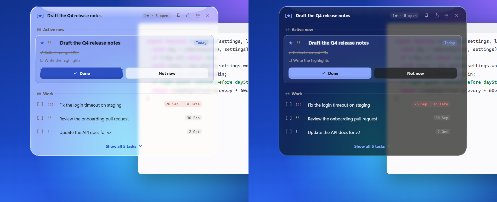

# Todos Island

**Your todo list, dropping in from the top of your screen.** A Dynamic-Island-style reminder for Windows that reads the plain markdown notes you already keep. No account, no database, no cloud.

  



## Why another todo app?

Most todo apps wait for you to open them. If a list drops out of your head the moment it leaves the screen, a waiting app doesn't help. Opening a big window full of tasks is also a distraction of its own.

Todos Island turns that around:

- **It comes to you.** A small island drops from the top of the screen on a schedule you set, shows the task you're on and the next few, then tucks itself away. It never takes your keyboard focus.
- **It keeps the list short.** Most days you work on one to three things. The island puts the task you're doing **now** first and shows only the next few. The full list is one click away.
- **Your notes stay the source of truth.** Tasks live in ordinary `.md` files that you can open and edit in Obsidian, VS Code, Notepad or anything else. The app reads them and writes back only when you click something.
- **Time decides what shows.** Work tasks lead during your workday. Personal tasks lead in the evening and on weekends.

## The notation

To set priority, a due date or the task you're on, just type it at the start of the line:

```markdown
- [ ] * !! 26 Sep — Send the weekly report
	client wants the numbers split by region
	- [x] Pull the numbers
	- [ ] Write the summary
- [ ] !!! Fix the login timeout
- [ ] Book the retro room
```

| Token | Meaning |
|---|---|
| `*` | **Now**: what you're working on (you can mark several) |
| `!` `!!` `!!!` | priority: low, medium, high |
| `26 Sep` | due date (the year is worked out for you) |
| indented `- [ ]` | a subtask |
| indented plain text | a description |

The tokens can go in any order, and all of them are optional. The app's own editor and quick-add box accept the same tokens, so what you type in the app is exactly what lands in your note.

## Features

- **The island.** It drops in on two schedules: one interval for your workday and one for evenings and weekends, each with its own on/off switch. Nothing pops between midnight and the start of your day.
  - Click a task to make it Now.
  - Tick `[ ]` to complete it.
  - Pin the island to keep it on screen.
  - Press <kbd>Ctrl</kbd>+<kbd>Alt</kbd>+<kbd>T</kbd> to show or hide it.
- **Liquid glass.** The island bends, blurs and tints the screen behind it, live, like real glass.
  - Choose how see-through it is in *Settings → Island → Glass*: **Solid**, 20%, 35%, 50% or 65%.
  - A soft glow behind the text keeps it readable over busy backgrounds. Nothing is measured while it runs, so it stays light.
  - Pick a **theme color** (blue, violet, teal, pink or graphite) and separate **label** and **task text sizes** in *Settings*.
  - The tasks window has a soft color field behind a glass header and composer.
- **Undo for everything.** Complete, delete, un-mark Now, reorder or clear done: every change you make gets a short countdown with an Undo button.
- **Share your day.** Pick tasks, then copy them as WhatsApp-ready text or Markdown, or export a `.md` file. This is useful for daily updates to a lead, a team or an AI assistant.
- **Keyboard first.** In the task list: <kbd>↑</kbd>/<kbd>↓</kbd> to move, <kbd>Enter</kbd> to edit, <kbd>Space</kbd> to complete, <kbd>\*</kbd> for Now, <kbd>0</kbd>–<kbd>3</kbd> for priority, <kbd>/</kbd> to search, <kbd>?</kbd> for all shortcuts.
- **English and العربية.** The whole interface switches language, and Arabic uses a full right-to-left layout. Your tasks and dates stay exactly as you wrote them.
- **Quiet updates.** When a new version is out, a green **Update** pill shows in the island and the tasks window. There's no popup, and a click opens the download page.
- **Honest when something breaks.** If a note goes missing or can't be read, you get a clear error. You never get an empty "all done" list.
- **Light and gentle.** No runtime dependencies. Light/dark follows Windows. Sounds are optional, it can start quietly with Windows, and a two-minute first-run setup gets you going.

<table>
<tr>
<td></td>
<td></td>
</tr>
</table>

## Install

1. Download `TodosIsland-Setup-x.y.z.exe` from [Releases](https://github.com/abdallahmagdy15/todos-island/releases) and run it. Windows SmartScreen may warn that the app is unsigned: choose *More info → Run anyway*.
2. The first-run setup asks which tasks you want to track (work, personal or both). It also asks where your notes live: pick existing files, or let the app create them in `Documents\todos-island`. Then set your work hours and how often the island drops in.
3. That's it. The island drops in right away. Right-click the **[★]** icon in the tray to open your tasks or quit.

## Privacy

- Your tasks and notes stay on your PC. The app collects no analytics and needs no account.
- The one network request: at startup (then once a day) it asks GitHub for the latest release number. Nothing about you or your tasks is sent. If a newer version exists, a small green **Update** pill appears in the top bar; nothing downloads on its own. You can turn this off in *Settings → App → Check for updates*.
- To draw the glass, the island streams the part of the screen directly behind it. The frames stay in the island's own renderer and are never saved or sent anywhere.
- While glass is on, Windows keeps the island **out of screenshots and screen shares**, so your tasks don't leak into a meeting. If you want the island to show up in screenshots, set Glass to **Solid**.

## Develop

```bash
npm install
npm start          # run the app
npm test           # parser, scheduler, composer, i18n parity, setup planner, CSS coverage
npm run contrast   # WCAG contrast gate for every color token, light and dark
npm run dist       # build the Windows installer (then: npm run verify-dist)
```

Electron, plain HTML/CSS/JS, zero runtime dependencies. [`AGENTS.md`](AGENTS.md) has the product principles, architecture map and house rules. Read it before contributing, whether you're a person or an AI.

## License

[MIT](LICENSE)
